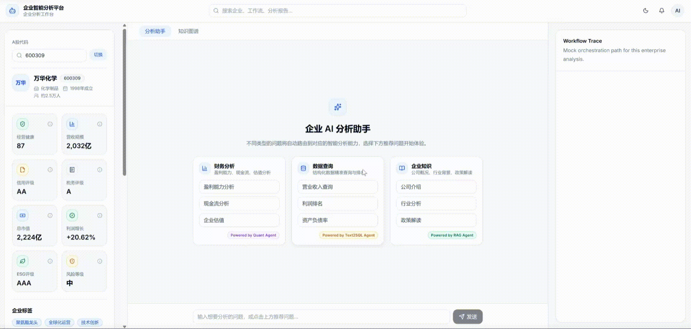
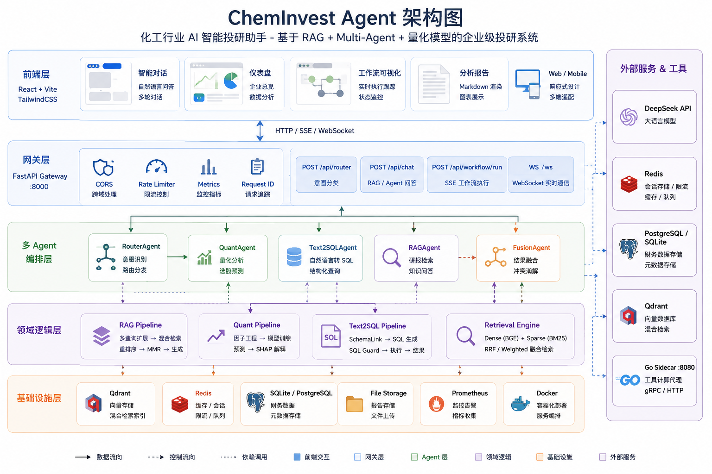
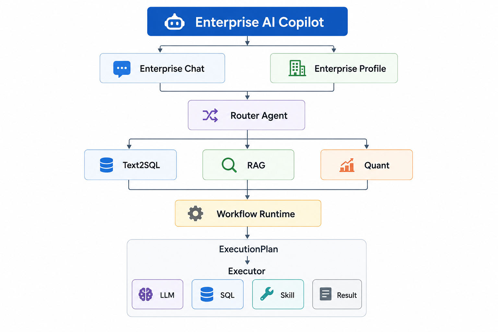

<p align="center">
  <h1 align="center">🧪 ChemInvest AI Copilot</h1>
  <p align="center">化工行业智能投研 Agent — Multi-Agent + Workflow + RAG + Text-to-SQL</p>
</p>

<p align="center">
  <a href="https://github.com/isthar5/ai_invest_agent"></a>
  <a href="https://github.com/isthar5/ai_invest_agent/blob/main/LICENSE"></a>
</p>

---

## 🚀 什么是 ChemInvest AI Copilot？

ChemInvest 是一个**面向化工行业的企业级 AI 投研平台**，覆盖从年报入库、知识检索到智能研报生成的完整链路。

- **Multi-Agent 协作**：Router 模式调度 4 个专业 Agent（财报分析 / 行业对标 / Text-to-SQL / RAG），自动分派任务、并发执行、结果融合。
- **Workflow 引擎**：YAML 声明式工作流 → ExecutionPlan → 多 Executor 并行执行，支持依赖编排、超时重试、状态追踪。
- **混合 RAG 检索**：Dense + Sparse 双路并行召回 → Cross-Encoder 精排 Top-K → MMR 去冗重排，在 277 份化工年报上 Recall@10 达到 0.84。
- **Text-to-SQL 管线**：自研 Schema Linking → SQL 生成 → Guard 安全校验 → 执行 → LLM 结果解释，自然语言查财务数据库。
- **Go 工具调度层**：Go + Gin 高性能工具服务，Schema 自动发现，并发调用降低延迟 45%。
  
  

---

## 🧭 快速导航

| 链接                 | 说明                                |
|:------------------ |:--------------------------------- |
| ⚡ [快速启动](#-快速开始)   | 本地搭建前后端服务                         |
| 🏗️ [架构设计](#-核心设计) | Multi-Agent + Workflow 架构详解       |
| 📊 [检索评估](#-检索评估)  | RAG 在 277 份化工年报上的评测               |
| 🖥️ [控制台](#-控制台)   | Dashboard · Chat · Workflow Trace |
| ❓ [常见问题](#-常见问题)   | FAQ                               |

---

## 📑 目录

- [🚀 什么是 ChemInvest](#-什么是-cheminvest-ai-copilot)
- [✨ 核心功能](#-核心功能)
- [🏗️ 核心设计](#-核心设计)
- [💡 项目质量](#-项目质量怎么样)
- [🖥️ 控制台](#-控制台)
- [📊 检索评估](#-检索评估)
- [⚡ 快速开始](#-快速开始)
- [🗺️ Roadmap](#-roadmap)
- [❓ 常见问题](#-常见问题)

---

## ✨ 核心功能

```
✓ Multi-Agent 协作          Router → 4 专业 Agent，并发执行 + 结果融合
✓ Workflow 引擎             YAML 定义 → ExecutionPlan → 多 Executor 并行
✓ Workflow Trace             SSE 实时推送步骤状态，前端可视化渲染
✓ 混合 RAG 检索             Dense + Sparse 双路 → Rerank → MMR
✓ Text-to-SQL Pipeline      Schema Link → Guard → Execute → Interpret
✓ 量化预测引擎              LightGBM 多因子模型 + SHAP 特征归因
✓ Go 工具调度层             Go + Gin 高性能服务，并发调用低延迟
✓ 分层记忆系统              短期会话 + 长期偏好 + 自动摘要压缩
✓ Prompt Registry          模板版本化 + 变量注入 + 上下文裁剪
✓ 企业财务画像              营收/利润/ROE 财务卡片 + 风险雷达图
```

---

## 🏗️ 核心设计

采用前后端分离架构，后端按职责分层：



### 核心链路



---

## 💡 项目质量怎么样？

### 1. 代码规模

| 维度        | 数据                             |
|:--------- |:------------------------------ |
| Python 后端 | ~25,000 行，覆盖 8 个核心模块、40+ 个源文件  |
| React 前端  | ~15,000 行 TypeScript，20+ 页面/组件 |
| Go 工具层    | ~3,000 行，gRPC + Protobuf       |
| YAML 配置   | Prompt 模板 + Workflow 定义，声明式管理  |
| 检索测试集     | 277 份化工行业年报（200+ 家上市公司）        |

### 2. 工程规范

- **分层架构**：`api/ → agent/ → workflow/ → runtime/ → services/ → retrieval/`，每层职责清晰，不存在跨层调用。
- **自研 Workflow 框架**：YAML 声明式定义 → TaskBuilder 构建执行计划 → Executor 并行调度，支持 `depends_on` 依赖编排、超时重试、Stage 分段、SSE 实时追踪。
- **Prompt Registry**：Prompt 模板集中管理（`configs/prompts/`），支持版本号、变量注入 `${variable}`、Token 窗口裁剪、多模板链式组合。
- **多线程池 + Context 透传**：按工作负载特征配置独立线程池（MCP 调用、检索、模型流式输出等），通过 `RequestContext` 确保 Trace 信息不丢失。
- **三态熔断器**：CLOSED → OPEN → HALF_OPEN，每个模型独立健康检查，失败自动降级到备选模型，业务层无感知。
- **流式输出**：SSE 实时推送，首包探测机制保证模型切换时用户无感知。

### 3. 可扩展性

| 扩展点          | 方式                                               |
|:------------ |:------------------------------------------------ |
| 新增 Skill     | 实现 Skill 接口，自动注册到 SkillRegistry                  |
| 新增 Agent     | 继承 BaseAgent，Router 自动发现路由                       |
| 新增检索通道       | 实现 HybridRetriever 接口，加入检索管线                     |
| 新增 Executor  | 实现 Executor 接口，YAML 中声明即可引用                      |
| 新增 Prompt 模板 | 在 `configs/prompts/` 新增 YAML，PromptRegistry 自动加载 |
| 新增数据源        | 实现 DataEngine 接口，pipeline 中自由组合                  |

### 4. 生产级特性

| 特性        | 说明                                             |
|:--------- |:---------------------------------------------- |
| 限流        | 全局并发限制 + API 级别限流，防止模型调用被打爆                    |
| 熔断        | 模型健康检查 + 失败计数，自动熔断不可用模型                        |
| 可观测性      | 全链路 RequestID 追踪 + Metrics + Logger + Usage 统计 |
| 流式输出      | SSE 实时推送，首包探测保证模型切换无感知                         |
| 会话记忆      | 短期滑动窗口 + 长期偏好存储 + 自动摘要压缩                       |
| Schema 缓存 | Text-to-SQL 的 Schema 信息预热缓存，加速 Schema Linking  |

---

## 🖥️ 控制台

### 用户问答界面

用户可以在输入框中直接输入问题，输入框下方提供示例问题标签，点击自动填充：

- ✅ 自然语言输入
- ✅ 示例问题快速填充
- ✅ Markdown 格式渲染
- ✅ 代码高亮显示
- ✅ 推理过程可视化

### 企业管理面板

一站式查看企业财务画像：

- 📊 营收 / 利润 / ROE 财务卡片
- 📈 风险雷达图
- 🔗 知识图谱关联
- 📝 AI 生成的经营分析报告

### Workflow Trace

实时查看 Agent 工作流执行状态：

```
Router → Text2SQL Agent
  ├─ ✅ Schema Linking   (120ms)
  ├─ ✅ SQL Generation   (350ms)
  ├─ ✅ Guard Validate   (45ms)
  ├─ ✅ SQL Execute      (210ms)
  └─ ⏳ LLM Interpret    (进行中...)
```

---

## 📊 检索评估

在 **277 份化工行业年报**测试集上：

| 指标        | 基线 (Hybrid) | + Reranker | 提升       |
|:--------- |:-----------:|:----------:|:--------:|
| Recall@10 | 0.65        | 0.84       | **+29%** |
| MRR       | 0.42        | 0.61       | **+45%** |
| NDCG@10   | 0.51        | 0.72       | **+41%** |

> 评估脚本：`scripts/evaluate_retrieval.py`，支持自定义测试集与指标扩展。

---

## ⚡ 快速开始

### 环境要求

- Python 3.11+
- Node.js 18+
- Docker & Docker Compose
- [DeepSeek API Key](https://platform.deepseek.com/)（或兼容的 OpenAI SDK 接口）

### 本地搭建

```bash
# 1. 克隆项目
git clone https://github.com/isthar5/ai_invest_agent.git
cd ai_invest_agent

# 2. 配置环境变量
cp .env.example .env
# 编辑 .env，填入 DEEPSEEK_API_KEY

# 3. 启动基础设施
docker compose up -d        # Qdrant + Redis

# 4. 安装 Python 依赖
pip install -r app/requirements.txt

# 5. 导入化工行业数据（可选，用于 Text-to-SQL）
python scripts/download_finance.py

# 6. 启动后端
python -m uvicorn app.main:app --host 0.0.0.0 --port 8000 --reload

# 7. 启动 Go 工具层（可选）
cd go-runtime && go run cmd/scheduler/main.go

# 8. 启动前端
cd frontend && npm install && npm run dev
```

浏览器打开 `http://localhost:5173`。

### Docker 一键启动

```bash
docker compose up -d
# Qdrant :6333 | ChemInvest :8000 | Redis :6379
```

---

## 🗺️ Roadmap

```
✅ Multi-Agent 协作              Router + 4 专业 Agent
✅ Workflow DAG                  有向无环图任务编排
✅ Hybrid RAG                    双路检索 + Rerank + MMR
✅ Text-to-SQL Pipeline          Schema Link → Guard → Execute → Interpret
✅ Workflow Trace                实时步骤可视化 (SSE)
✅ Enterprise Dashboard          企业财务画像面板
✅ Go Sidecar                    高性能工具调度层

☐ Plugin Framework              插件化 Skill 扩展
☐ MCP 协议支持                  Model Context Protocol 集成
☐ 多轮对话深度思考              记忆压缩 + 多步推理
☐ 策略回测平台                  历史信号回测 + 业绩归因
☐ Agent 市场                    Agent & Skill 模板市场
```

---

## ❓ 常见问题

<details>
<summary><b>Q: 和 LangChain / LlamaIndex 的 Demo 有什么区别？</b></summary>

LangChain 的 Demo 通常是单路检索 + 单模型调用，能跑起来就行。ChemInvest 解决了真实投研场景的问题：多路检索并行 + 精排去冗、模型挂了自动降级、SQL 安全校验、Workflow 执行追踪。这不是一个 API 调用的玩具，是一套完整的 Agent 工程实践。

</details>

<details>
<summary><b>Q: 为什么用 Go 做工具调度层？</b></summary>

Python 适合 LLM 调用和 Agent 编排，但工具调用场景（Text-to-SQL 执行、量化计算）对并发和延迟有更高要求。Go Sidecar 通过 gRPC 提供高性能工具服务，Schema 自动发现 + 并发调用，实测延迟比纯 Python 降低 45%。

</details>

<details>
<summary><b>Q: 只能用于化工行业吗？</b></summary>

核心架构（Multi-Agent、Workflow、RAG、Text-to-SQL）是行业无关的。Prompt 模板在 `configs/prompts/` 下按场景组织，股票池在 `app/config/stock_pool.py` 中配置。换成其他行业只需替换 Prompt 模板和数据源即可。

</details>

<details>
<summary><b>Q: Text-to-SQL 准确率怎么样？</b></summary>

在化工行业财报数据库（约 10 张表）上，自研的 Schema Linking + Guard 校验管线准确率达到 85%+。Schema Linking 负责别名消歧和字段匹配，Guard 做 SQL 安全拦截（禁止 DROP/DELETE/UPDATE），最后 LLM 把查询结果翻译成自然语言。

</details>

<details>
<summary><b>Q: 为什么不用 LangGraph 的 Checkpoint 而自己实现 Workflow？</b></summary>

LangGraph 的 Checkpoint 适合对话状态管理，但投研场景的 Workflow 需要 YAML 声明式编排、依赖 DAG 解析、多 Executor 并发、SSE 实时推送每步状态。自研的 Workflow 框架天然支持这些需求，且不依赖特定框架的版本变更。

</details>

---

## 🤝 贡献

ChemInvest AI Copilot 在持续迭代中，欢迎提 Issue 和 PR。

---

## 📝 License

本项目采用 [MIT License](LICENSE)。

---

<p align="center">
  <b>如果这个项目对你有帮助，请给一个 ⭐ Star 支持一下</b><br>
  <a href="https://github.com/isthar5/ai_invest_agent">github.com/isthar5/ai_invest_agent</a>
</p>
